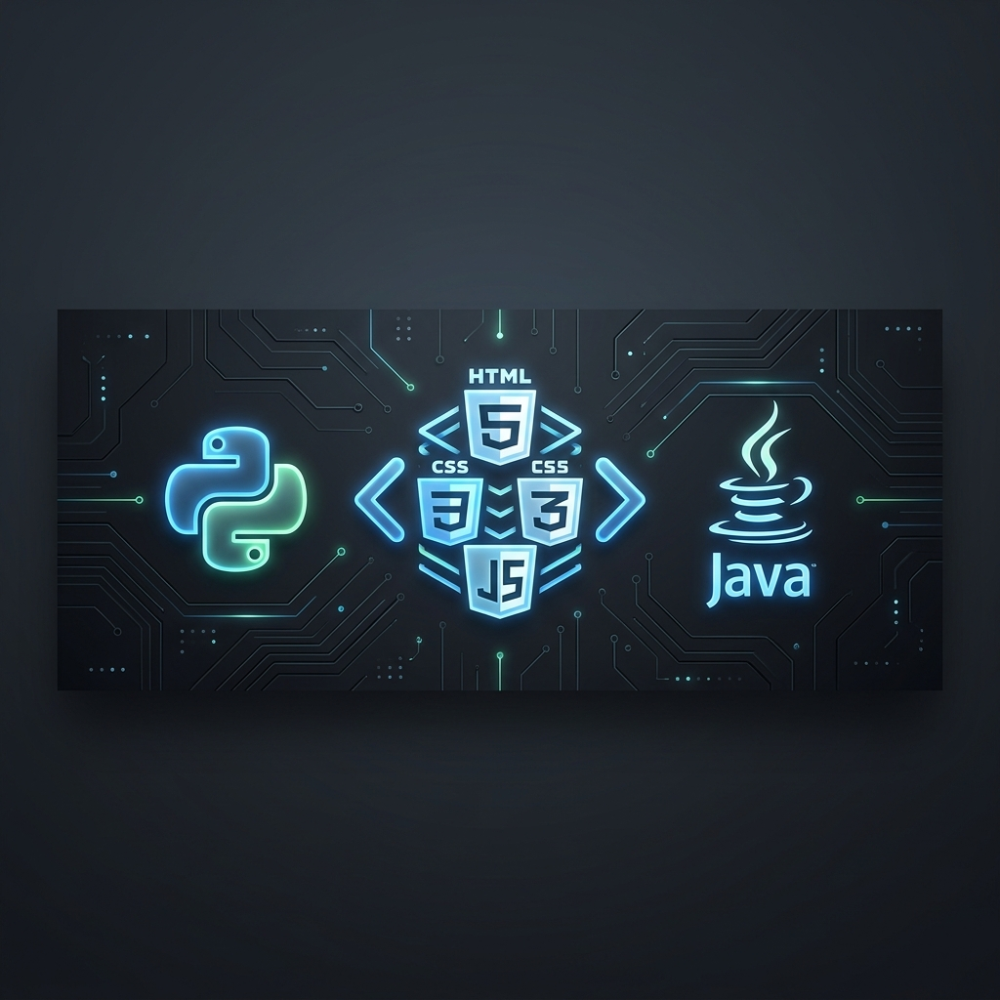

# ¡Hola! Soy Ignacio Odorico👋

---

### 🚀 Sobre Mí

Soy estudiante avanzado de la **Tecnicatura Universitaria en Programación (UTN)**, orientado al desarrollo Full Stack.
Me especializo en **backend con Java**, lenguaje en el que he trabajado con especial dedicación, aplicando conceptos de POO, API REST y persistencia de datos.
Además, tengo experiencia en **frontend**, con dominio de HTML, CSS, JavaScript y TypeScript, desarrollando interfaces claras, dinámicas y responsivas.

Manejo bases de datos relacionales y no relacionales, herramientas como **MySQL, Mongodb y DBeaver**, y disfruto construir proyectos donde se conecten las distintas capas de una aplicación.

Busco una oportunidad para iniciar mi carrera profesional en un equipo donde pueda seguir aprendiendo, aportar soluciones reales y crecer como desarrollador Full Stack.

---

### 🌐 ¡Visitá mi Portfolio!

  
   
  <i>Explorá mis proyectos más recientes y mi trayectoria completa.</i>

---

### 🛠️ Mi Stack Tecnológico

| Backend | Frontend | Herramientas |
| :---: | :---: | :---: |
|  |  |  |

---

### 📚 Aprendiendo Ahora (Continuous Growth)

  
  

> *Incorporando herramientas de última generación para potenciar la escalabilidad y el diseño moderno.*

---

### 📊 Mis Estadísticas de GitHub

  
   
  

---

### 📫 Contacto

  
  
  

